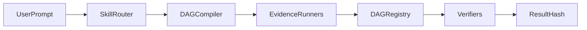

# Pharos TrustMesh

[](https://github.com/erenyeager880/Pharos-Trust-Mesh/actions/workflows/ci.yml)

> **A reusable Agent Skill for verifiable multi-agent workflows on Pharos.**

Pharos TrustMesh is a reusable Agent Skill that lets AI agents compile, execute, verify, and anchor multi-step workflows on Pharos using real evidence hashes.

It compiles dependency-ordered agent DAGs, binds **Pyth Hermes** off-chain prices into **layer evidence hashes**, registers executions on **DAGRegistry**, requires **multi-agent signoff**, and rewards verifiers with on-chain **verificationScore** points.

## Judge Quickstart (5 min)

```bash
npm install
forge build
forge test
npm run demo:local
npm run verify-execution demo-workflow-payment-local.json
```

### What success looks like

1. **forge test:** `33 passed` (see [`demo-output-forge-test.txt`](demo-output-forge-test.txt))
2. **verify-execution:** every layer shows `PASS`, plus `Completed: PASS`, `Result hash: PASS`, `Overall: PASS` (exit code `0`)
3. **Generated artifact:** `demo-workflow-payment-local.json` with `executionId`, `layerHashes[]`, `resultHash`, `registry`, `registerTx`, `finalizeTx`
4. **Written on-chain (local Anvil):**
   - Fresh `DAGRegistry` at `0x5FbDB2315678afecb367f032d93F642f64180aa3`
   - `registerExecution` -> 3x `completeLayer` (layer 0 runs balance + Pyth in parallel) -> 2x `approveExecution` -> `finalizeExecution`
   - Layer evidence hashes and `resultHash` stored in registry
5. **Atlantic (optional):** [DAGRegistry on PharosScan](https://atlantic.pharosscan.xyz/address/0xB825EAe9BA48B44374be0DD56EE701A0dF2A24E6) via `npm run demo:atlantic`

### Try these prompts

| Plain-English prompt | Workflow | Command |
|----------------------|----------|---------|
| "Check BTC price and prove it on-chain" | `oracle-validation` | `npm run workflow -- --template oracle-validation --oracle BTC/USD --network local` |
| "Snapshot wallet risk" | `wallet-risk-snapshot` | `npm run workflow -- --template wallet-risk-snapshot --network local` |
| "Verify these URLs and anchor the evidence" | `research-url-verification` | `npm run workflow -- --template research-url-verification --network local` |

Each run writes `demo-workflow-<dagId>-local.json`. Verify with `npm run verify-execution <artifact.json>`.

## Architecture



| Node | Implementation |
|------|----------------|
| SkillRouter | [`SKILL.md`](SKILL.md) prompt routing |
| DAGCompiler | [`compile-dag.js`](assets/dag-executor/compile-dag.js) |
| EvidenceRunners | [`execute-layer.js`](assets/dag-executor/execute-layer.js) + [`task-runners.js`](assets/dag-executor/task-runners.js) |
| DAGRegistry | [`DAGRegistry.sol`](src/dag-executor/DAGRegistry.sol) |
| Verifiers | `approveExecution` + [`verify-execution.js`](scripts/verify-execution.js) |

## Why Pharos?

- **Agent economy** - workflows are reusable and cataloged by canonical `dagHash`
- **On-chain payments / PHRS** - native balance evidence and gas on Pharos
- **Verifiable agent work** - layer hashes bind off-chain evidence (Pyth, HTTP, URLs) on-chain
- **Reusable skills for Phase 2 agents** - [`SKILL.md`](SKILL.md) + catalog/templates (+ optional [MCP tools](mcp/README.md))
- **Verifier reputation** - `verificationScore` increments on successful `approveExecution`
- **SALI-friendly parallel layers** - independent tasks run concurrently before anchoring

Trust assumptions: [`references/trust-model.md`](references/trust-model.md)

## Shipped Workflows (real evidence)

| dagId | evidence sources |
|-------|------------------|
| `payment` | PHRS balance + Pyth ETH/USD |
| `oracle-validation` | N x Pyth feeds + consensus |
| `defi-market-signal` | Pyth BTC/USD + Binance APIs |
| `wallet-risk-snapshot` | PHRS native balance |
| `research-url-verification` | Real URL content hashes |

```bash
node assets/dag-executor/compile-dag.js --catalog
npm run workflow -- --catalog payment --network local
npm run workflow -- --template oracle-validation --oracle BTC/USD --network local
npm run workflow -- --template defi-market-signal --network local
npm run compose-dag -- --oracle BTC/USD --balance
```

Authoring guide: [`references/dag-schema.md`](references/dag-schema.md). Agent playbook: [`SKILL.md`](SKILL.md#user-prompts--agent-workflow).

## Execution Evidence

Layer 0 runs independent tasks in parallel (e.g. balance + Pyth price), computes:

```
layerHash = keccak256(abi.encode(layerIndex, [taskOutputHashes...]))
```

and submits `completeLayer(executionId, 0, layerHash)`. Verifiers re-fetch Hermes / RPC data and compare on-chain hashes.

## Compiler Optimization (payment DAG)

```
Layer 0: PHRS balance + Pyth ETH/USD (parallel, 2 tasks)
Layer 1: validate aggregate
Layer 2: record result hash on DAGRegistry
SALI friendly: yes
```

## SALI (planning + execution)

**Planning:** The compiler groups dependency-free tasks into layers and emits `saliPlan` with `executionMode: parallel` when tasks are conflict-free.

**Execution:** `execute-layer.js` runs parallel layers via `Promise.all`, computes real evidence hashes, then anchors them on `DAGRegistry` with `completeLayer`.

```bash
npm run demo:local      # payment on Anvil - no PRIVATE_KEY
npm run demo:atlantic   # payment on Atlantic - requires PRIVATE_KEY
npm run verify-execution demo-workflow-payment-local.json
```

## Atlantic Wallet Setup

For quick demos, set only the executor key:

```env
PRIVATE_KEY=0x...
RPC_URL=https://atlantic.dplabs-internal.com
```

For stronger multi-agent testnet runs, set independent verifier wallets too:

```env
VERIFIER_B_PRIVATE_KEY=0x...
VERIFIER_C_PRIVATE_KEY=0x...
```

When verifier keys are provided, the workflow runner checks all three addresses are distinct and funded before sending transactions. If verifier keys are omitted, it uses deterministic demo verifier wallets and funds them from `PRIVATE_KEY`.

## Prerequisites

| Tool | Purpose |
|------|---------|
| [Foundry](https://book.getfoundry.sh/getting-started/installation) | `forge build`, `forge test`, `cast` |
| Node.js 18+ | DAG compiler, workflow runner, Pyth helpers |
| `.env` (Atlantic only) | Copy from `.env.example` - `PRIVATE_KEY` required for testnet writes |

Local workflows (`--network local`) use Anvil test accounts and need no keys.

## Testing

| Layer | Command | What it validates |
|-------|---------|-------------------|
| Unit (Solidity) | `forge test` | `DAGRegistry` register -> layer -> approve -> finalize/fail paths |
| Integration | `npm run verify-execution <artifact.json>` | On-chain hashes match demo workflow output |

Full guide: [`references/testing.md`](references/testing.md). Captured outputs: `demo-output-forge-test.txt`, `demo-output.txt`.

## npm Scripts

| Script | Description |
|--------|-------------|
| `npm run demo:local` | Payment workflow on local Anvil |
| `npm run demo:atlantic` | Payment workflow on Atlantic (needs `PRIVATE_KEY`) |
| `npm run workflow -- --template <id> --network local` | Run a catalog/template workflow |
| `npm run compose-dag -- --oracle BTC/USD --balance` | Build a custom DAG JSON |
| `npm run verify-execution <file.json>` | Cross-check on-chain state vs artifact |
| `npm run compile-dag` | Compile DAG file to layered plan + `dagHash` |
| `npm run mcp:start` | Start MCP server (agent-callable tools) |
| `npm run mcp:smoke` | Smoke test MCP tool logic |
| `npm run mcp:smoke-stdio` | Smoke test MCP stdio protocol |

## Live deployment

**Atlantic DAGRegistry:** [`0xB825EAe9BA48B44374be0DD56EE701A0dF2A24E6`](https://atlantic.pharosscan.xyz/address/0xB825EAe9BA48B44374be0DD56EE701A0dF2A24E6) (verified). Full Atlantic metadata: `deployments/atlantic.json`.

## Documentation map

| File | Audience | Contents |
|------|----------|----------|
| [`SKILL.md`](SKILL.md) | AI agents | Capability index, plain-English workflow routing |
| [`references/dag-executor.md`](references/dag-executor.md) | Agents / operators | Per-command templates for every DAGRegistry operation |
| [`references/dag-schema.md`](references/dag-schema.md) | Authors | DAG JSON schema and template catalog |
| [`references/testing.md`](references/testing.md) | Developers / judges | Test commands, coverage matrix, CI |
| [`references/trust-model.md`](references/trust-model.md) | Reviewers | On-chain vs off-chain trust assumptions |
| [`SUBMISSION.md`](SUBMISSION.md) | Hackathon reviewers | Demo commands and live contract link |
| [`mcp/README.md`](mcp/README.md) | MCP clients | Tool reference, agent recipes, Cursor/Claude setup |

## Structure

```
SKILL.md                 Agent entry point
references/              query, transaction, contract, dag-executor, dag-schema, testing, trust-model
assets/dag-executor/     Compiler, catalog, templates, Pyth helpers
src/dag-executor/        DAGRegistry.sol (Foundry compile target)
test/                    DAGRegistry.t.sol (33 Foundry tests)
scripts/                 Workflow runner, demo scripts, verify-execution
mcp/                     MCP server wrapping CLI tools
demo-workflow-*.json     Integration test artifacts (local + Atlantic)
```
